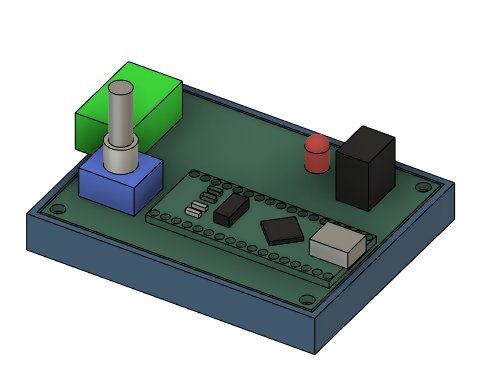

# esp32_cnc20mm - Vacuum & other Accessories

**[Home](readme.md)** --
**[Design](design.md)** --
**[Details](details.md)** --
**[Electronics](electronics.md)** --
**[Box](box.md)** --
**[Spindle](spindle.md)** --
**[Y-Axis](y_axis.md)** --
**[Table](table.md)** --
**[Build](build.md)** --
**[Laser](laser.md)** --
**Accessories** --
**[Software](software.md)** --
**[Notes](notes.md)** --
**[Projects](projects.md)**

The main accessories that I made for this machine have to do with
a **vacuum system** to remove dust and smoke.

- [Shop Vac with Brushless Motor](#a-shop-vac-with-brushless-motor)
- [Filtration System](#b-filtration-system)
- [Laser Air Scoop Attachment](#c-laser-air-scoop-attachment)
- [Dust Boot and Brush Attachment](#d-dust-boot-and-brush-attachment)

## A. Shop Vac with Brushless Motor

No way I'm gonna sit in a room while a shop vac runs for hours at a time!

TODO: Arduino-vacuum1 repo

There is an *as yet **unpublished** project*
for the *controller PCB* and *3D printed box* I made for this subproject,
but basically I modified a small Shop Vac to replace it's loud and inefficient
motor with a *quiet and efficient* **brushless DC motor**.  Here is the
vacuum I started with:

I have had several of these small vacuums.  They are perfect for the boat.
Since they go bad after a while, I had an old (red) one sitting around,
which I took apart and modified to change it to a brusheless motor.
This is actually the second iteration of this subproject.  I started
by getting this existing
[brushless vacuum motor](https://www.ebay.com/itm/263945742552)
at a very reasonable price.

This little vacuum motor is **surprisignly powerful**, when running on 12 volts and drawing about 7 amps,
or using about 85 watts of power, much less than it's rated 400+ watts of capability, it is about as
powerful as the small shop vac.   And way less noisy.

There is, however, a **signficant drawback** to it's mechanical design that makes this difficult
to incorporate into a *vacuum system design*.   That problem is that, as designed, the air that
is sucked in through the small diameter end, **flows around and through the motor**.

**Now I see the solution is/was to place this downstream of the filtration system**

As far as retrofitting it onto the existing shop vac this turned out to cause a lot
of problems.  First and foremost was that the *housing* of the shop vac is
not designed to be air-tight or connected to the *air exit*.  The existing design
of the shop vac had a rotor spinning in a confined space that is connected
to the air exit.  Here's some pics of the dis-assembled shop vac:

And, unfortunately, the motor itself provided the shaft, support, and bearings
for the rotor and I could not come up with a good way to attach it to the brushless
motor, and when I did, the large rotor required more torque than the motor was
able to produce and it did not spin but instead quickly overheated.

So, for my **second iteration** of this sub-project (I'm not *even* showing
you any pictures of the *first* iteration!), I decided to **disassemble
the brushless vacuum motor** and use it's **rotor** in a new 3D printed
design.   Here's a pic of the dissasembled brushless motor after I
removed (broke off) the plastic housing:

I then **designed** a new rotor housing and mount to fit on the shop-vac:

and *3D printed** the parts for the modification:

Which were then assembled, with the ubiquitous **Pheonix connector**,
like this:

The exisitng cover from the shop-vac fits nicely over this, and thus
far I have not had any problems with the motor overheating (although
I have had to clean the rotor every few months as even a little bit
of dust build up will cause it to rub on the 3D printed parts which
*do* then overheat and threatent to melt!).

### Vacuum Controller PCB and Box

The vacuum uses a *separate external* **15A 24V power supply**, which is
identical in size and shape to the power supply built into
the [box](box.md).  In addition  I created an *Arduino Nano* based
PWM controller board and 3D printed a box for the vacuum.

The controller has a **buck convertor** to bring the 24V down
to 5V for the Arduino, uses a **Rotary Controller** to modify the speed
of the vacuum, and has a **Flashing LED** that flashes
once every two seconds when *off*, flashing more rapidly,
and increasing to being continuously lit at *full power*.

When assembled it looks like this:

## B. Filtration System

In addition to the *dust bag* that is inside the *shop-vac*, I
added a separate [cyclonic dust separator](https://www.ebay.com/itm/266331405243) that I got
from ebay:

It mounts on top of a **5 gallon bucket**, and, along with various hoses and adapters,
and a quantity of *dryer vent hose*, I created the whole system to vent the air to the outide.

This system will *suck up* the majority of the **dust** and **millings**
when using the spindle and will *vent* the majority of the **smoke**
when using the laser to engrave or cut wood.  With the relatively
**low noise**, in general I can stay in the work area while the machine
is working, although I occasionally just *open the door and some windows*
if I am surface engraving and don't want to bother hooking up the
vaccum scoop, below.

## C. Laser Air Scoop Attachment

The first specific Vacuum accessory I created was a **scoop** that would
suck up the smoke while I was laser engraving. It consists of two parts,
one is the **hose connector** that attaches to the Z-Axis, and the
other part is the **scoop** itelf which compression fits into the
connector.

In the second image I show how it attaches to the machine.
It is designed such that the standard end of hose vacuum plugs
into the connector with a compression fitting.

## D. Dust Boot and Brush Attachment

Although today I can buy a **Dust Boot and Brush** that more closely matches what I want,
at the time I built the machine I could not, and *mounting* it to the machine would not
be trivial even if I could.

And, as it turned out, the previous *Laser Scoop* thing I made did not provide a good
way to mount this either.   So I bought some [bristles](https://www.ebay.com/itm/175834559723) on ebay ...

... and designed and 3D printed this thing:

The hose attachment is **bolted** to the machine.  The **two halves** of the boot *slide*
into the hose fixture and are held in place by **magnets** and can easily be
removed in order to *change bits* in the machine during jobs.

**Next** - Installing and Understanding the [**Software**](software.md) for the machine ...