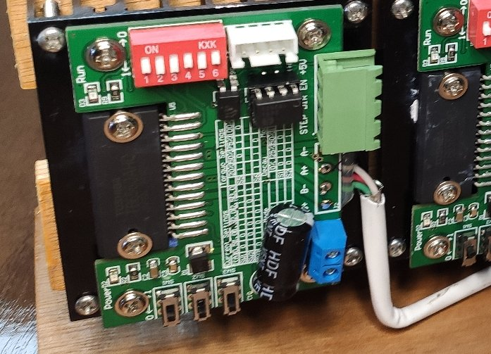
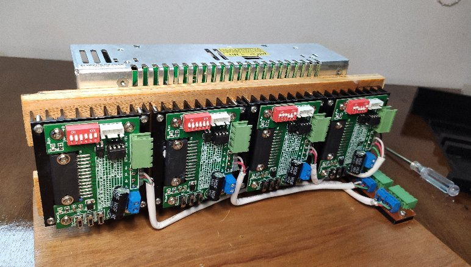

# esp32_cnc20mm - The Controller box

**[Home](readme.md)** --
**[Design](design.md)** --
**[Electronics](electronics.md)** --
**Box** --
**[Y-Axis](y_axis.md)** --
**[Table](table.md)** --
**[Build](build.md)** --
**[Accessories](accessories.md)** --
**[Laser](laser.md)** --
**[Details](details.md)** --
**[Projects](projects.md)**

This page shows the design and assembly of the Controller Box.
The controller box ended up being nearly as complicated as the machine itself.

Please note that these photos show the original V3 circuit board that
was subsequently replaced, and does not show a number of additions
(i.e. the laser power supply connector) that were subsequently made.

After having created all the [electronics](electronics.md) on the previous page,
assembling the box included the following steps:

### A. Preparation:

Mill the Wooden parts on the cnc3018 version 2

- the boards that connect the Stepper Drivers to the Power Supply
- the base
- the left (switch) cover
- the right (display) cover
- the front, face, and top boards

3D print the Plastic parts

- the left, middle, and right big pieces
- the mount for the 120V plug
- the four mounts for the PCB
- the two mounts for the big and small Edge Connectors

Modify the Four Stepper Driver Boards

- remove (desolder) the lower 6 pin connector
- add a screw terminal for the 24V power and ground to the board
- cut and strip wires to connect the Stepper Driver to the big Edge Connector Board
- solder the connecting wires to the board

### B. Assemble Power Supply and Stepper Drivers

- Mount the Stepper Drivers to the Power Supply
- Attach the wires from the Stepper Drivers to the big Edge Connector Board
- Mount the Power Supply, Stepper Drivers, and big Edge Connector on the Base

- Create the 24V Wiring Harness

- Attach the 24V Wiring Harness to the Power Supply and Stepper Drivers
 and connect it to the Power Supply

### C. High Power Supply

- Solder the green and black wires to the 120V High Voltage Socket and Switch, and Wires together
- Solder two red wires the 24V Controller (PCB) Switch to a wired connector

- Mount the 120V connector on the base
- Attach the Left and Middle Plastic pieces to the Base
- Connect the 120V wires to the Power Supply
- Run a black ground wire for the PCB 24V power supply
- Attach the Left Cover Wood and complete the 120V Circut

### D. PCB and Cables/Connectors

- Mount the small Edge Connector to the Base
- Mount the PCB and USB Connector to the base
- Connect the 24v power to the PCB
- Plug the USB Connector into the ESP32

- Mount the SDCard Module and Cable to the Right Plastic piece
- Attach the Right Plastic piece to the Base

### E. Finish Up

- Connect the PCB and Stepper driver with four JST cables and connectors
- Connect the PCB to the small Edge Connector with two JST cables and connectors

- Mount the Display on the Right Wood Cover
- Plug the Display into the PCB and Attach the Right Wood Cover

- Attach the remaining Face, Front, and Top Wooden pieces

**The Finished Controller Box**

**Next** - Building the [**initial Y Axis**](y_axis.md) for the machine ...
