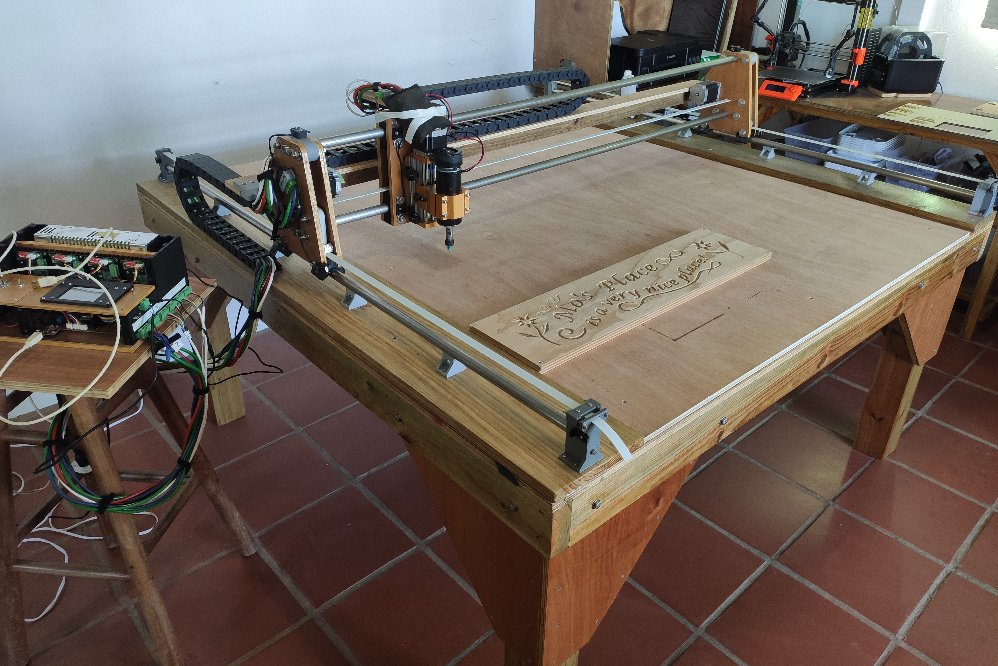

# esp32_cnc20mm - Buillding the Machine

**[Home](readme.md)** --
**[Design](design.md)** --
**[Details](details.md)** --
**[Electronics](electronics.md)** --
**[Box](box.md)** --
**[Spindle](spindle.md)** --
**[Y-Axis](y_axis.md)** --
**[Table](table.md)** --
**Build** --
**[Laser](laser.md)** --
**[Accessories](accessories.md)** --
**[Software](software.md)** --
**[Notes](notes.md)** --
**[Projects](projects.md)**

After I built the [box](box.md) and the [initial Y-axis](y_axis.md) and [**redesigned**](design.md)
the entire machine, while *Israel* was building the [table](table.md), over a periood of *several months*,
I collected and created the **many parts** that were necessary to build the machine.

In building the [initial Y-axis](y_axis.md) I had already 3D printed and tested the
[Y-axis Bearings](https://github.com/phorton1/Arduino-esp32_cnc20mm/blob/master/docs/design.md#y-axis-bearing),
shown below, and cut the *Y-Tubes* to length.

## A. Prep Work

### Cut, Drill and Tap the X-Axis Stainless Steel Tubes

It was challenging to drill and tap the necessary **M3 threaded holes** into the
X-Tubes.  I built a special jig (not shown) that held a dremel tool at 90 degrees,
**dead center** along the top of the tubes, and drilled the holes at the correct
spacing with a **2.5mm end mill** bit.
Then I **tapped** them with an M3 tap.  The metal is fairly thin, and brittle, and
I managed to *break* one tap in the process, but luckily had extra M3 taps.

You can barely see the holes in the metal tubes in the **below** photo.

### Mill the Plywood Pieces

In the following image you can see the **plywood pieces** for the X and Y *Sleds*.
After generating the gcode in Fusion 360, I *milled* them on my
[second cnc3018 machine](https://github.com/phorton1/Arduino-esp32_cnc3018/blob/master/docs/version2.md),
then *sanded* them and applied 3 coats of **clear polyurathane**.

The **four pieces** for the *two* X-Sleds are *identical* and all the holes are *thru-and-thru*, so the
were parts can be used in either *mirror configuration*.  The two pieces for the Y-Sled are *different*, and
both have pockets milled into them for the *5mm idler* bars, so they have a distinct *front and back*.

### 3D Print Parts

There are quite a few **3D Printed** parts needed to assemble the machine.  They are
printed out of **PLA**.  I printed the parts in different colors (black and grey)
purely for aesthetic reasons.

You can see some parts are dual color, as, while in the middle of printing the X-Ends I ran
out of the lighter grey and switched to a darker grey filament.  After assembling the machine,
I eventually reprinted those parts in a single consistent filament color.

### Gather the Metal Hardware

As I said, this build took **months** to complete, largely due to the fact that
it took a long time to order, and receive, the diverse selection of *screws,
nuts, bolts, washers, and bearings* that were needed for the project.

The big container has a selection of **M8 and M6** nuts, bolts, and washers.
There are separate containers of **M5, M4, M3, and M2 machine** bolts, screws,
nuts, and washers, as well as a selection of **M3 wood** screws.

There are also *dozens* of **8mm and 5mm bearings** and a variety of
assorted **Pheonix** electrical connectors in the trays.

### Sub-Assemblies

The
[**X-Sleds**](https://github.com/phorton1/Arduino-esp32_cnc20mm/blob/master/docs/design.md#x-axis-sled)
and
[**Y-Sled**](https://github.com/phorton1/Arduino-esp32_cnc20mm/blob/master/docs/design.md#y-axis-sled)
were separately assembled. That process is not shown on this
page, but is pretty straight forward.

Another sub-assembly that was required was to *solder wires* and
*assemble* the **eight limit switches** that would be installed on the machine.

## B. Assembly

Finally, after the [table](table.md) was completed and all the parts
were present, it was time to start the **final assembly** of the machine.
It was easiest to do this with the table top sitting on the floor
of my work area.

### X-Tubes

After mounting the **1x6" and 1x8" runners** to the table I attached the
[X-Tube supports](https://github.com/phorton1/Arduino-esp32_cnc20mm/blob/master/docs/design.md#x-tube-supports)
to the X-Tubes and carefully **aligned them** and screwed them onto the machine:

Note that in the above image you can also see the piece of *1/2" plywood* that is the **waste board**
for this machine. Sigh, I cannot source **MDF** locally (as it just rots in the hardware stores
in the tropics) so I resorted to using plywood for the waste board. Also note that the wood is **bowed**.
I won't go into how bad the selection of wood available to me is here, but trust me, there is not
a flat or square piece of wood to be found in this town!

### Sleds and Y-Tubes

After sliding the
[**X-Sleds**](https://github.com/phorton1/Arduino-esp32_cnc20mm/blob/master/docs/design.md#x-axis-sled)
onto the tubes (and supporting them temporarily with some wooden blocks), I attached the
[**X-Tube Ends**](https://github.com/phorton1/Arduino-esp32_cnc20mm/blob/master/docs/design.md#x-tube-ends)
to the tubes and screwed them onto the machine.

Then in a *somewhat tricky* assembly maneuver, I slid each of the *Y-Tubes* through one of the
X-Sleds, through the bearings in the Y-Sled, and into the other X-Sled.  While doing that I had
to support the Y-Sled at the approximate necessary height, and in line, with some wooden blocks.

### Attach Drag Supports and Chains

When the basic **Axes** were assembled, I added the
[**Drag Supports and Chains**](https://github.com/phorton1/Arduino-esp32_cnc20mm/blob/master/docs/details.md#a-drag-supports-and-chains)
resulting in the machine looking like this:

At this point I did whatever **adjustments** were necessary to ensure that the machine **moved
freely** about all the axes.

## C. Wiring

The cables are sufficiently long so that I can change to a **4 by 8 foot** machine by
merely building a new (or adding on to the existing) **table** and cutting new **X-tubes**
and adding a few more **X-Tube Supports**.  That resulted in some of the cables being
as long as **14 feet**!!

Coming up with the necessary cables was also a hassle, and I didn't have exactly
what I wanted on hand when I assembled the machine.  Nonetheless, there are:

- **shielded 16 gauge 4 conductor** cables for each of the four *stepper motors*
- **shielded 2 conductor** cables for each of the *limit switches*
- **shielded 18 guage 3 conductor** cable for the *Laser* power and PWM signal
- **shielded 16 guage 2 conductor** cable for the *Spindle* power

After feeding them through the **Drag Chains** I was left with **twelve cables**
ending in approximately the same place.  Once again, there are about **four
extra feet** of cables *just in case* I want to expand the machine to a
full 4x8 feet at some point.  For now the extra cables allow me to
place the [controller box](box.md) in a convenient position.

## D. Belts

Then it was time to **cut** the
[**15 mm belts**](https://github.com/phorton1/Arduino-esp32_cnc20mm/blob/master/docs/design.md#a-belts-and-stepper-motors)
to length, thread them through the **idlers and pullies**
and attach them to the
[**X**](https://github.com/phorton1/Arduino-esp32_cnc20mm/blob/master/docs/design.md#x-tube-ends)
and
[**Y**](https://github.com/phorton1/Arduino-esp32_cnc20mm/blob/master/docs/design.md#y-belt-tensioners)
tensioners.

It was quite *tricky* to feed the belts and loop them around the stepper pullies
and back out the other side, but eventually, with a bit of *stainless steel wire*
and *string* to help out, I got them through, attached them, and adjusted the tension,
making sure that they did not *slip* and had sufficient contact to turn the
stepper motors when I moved the sleds by hand.

## E. Intial Testing

With the machine still sitting on the floor,
I attached **connectors** to all the cable ends,
connected them together as needed, and plugged them into
the [box](box.md) and tested the machine.

**It worked!!**.

## F. Raise the Table

Finally, I was ready to *raise the table* and attach the
**legs**.  Below is the only image I have of the machine
near that point in time.  It shows the first
[project](projects.md) that I completed soon thereafter.

I didn't add the **Cable Connectors** until later.  In this initial version
the connectors were merely secured to the machine with *velcro* or *masking tape*.

**Next** - Adding a bigger [**Laser**](laser.md) ...
