# esp32_cnc20mm - Basic Mechanical Design

**[Home](readme.md)** --
**Design** --
**[Details](details.md)** --
**[Electronics](electronics.md)** --
**[Box](box.md)** --
**[Spindle](spindle.md)** --
**[Y-Axis](y_axis.md)** --
**[Table](table.md)** --
**[Build](build.md)** --
**[Laser](laser.md)** --
**[Accessories](accessories.md)** --
**[Software](software.md)** --
**[Notes](notes.md)** --
**[Projects](projects.md)**

Perhaps the most difficult design decision was how large to make the machine.
The design is theoretically scalable up to cutting a full 4x8 foot sheet of plywood,
or could be made smaller, for instance, having a 2x3 foot work area. The machine itself
is about 1 foot bigger in each dimension than the work area. In the
end I settled on a machine with a 4x4 foot work area, that would be about
5z5 feet in actual size.

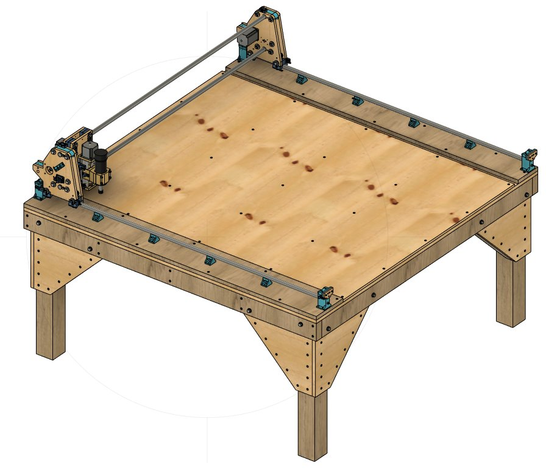

The design is incremental in that it is only at the end of the design process
that one needs to narrow in on a specific machine size.  Most of the design
consideration are independent of the size of the machine.

## A. Belts and Stepper Motors

Note that the belts themselves are not modelled in these designs.  They are
[15mm HTD 3M Heavy Duty timing belts](https://www.ebay.com/itm/172262894913)
that I purchased on Ebay.
The dimensions are known, and utilized in the design,
but I did not model the belts themselves.

[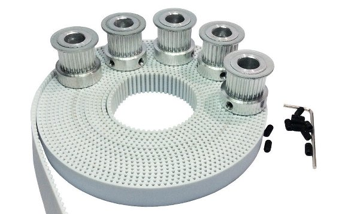](https://www.ebay.com/itm/172262894913)

For the main stepper motors, I selected [this](https://www.ebay.com/itm/193676837497) set from Ebay
which also included the controller boards and power supply and 15mm pullies:

[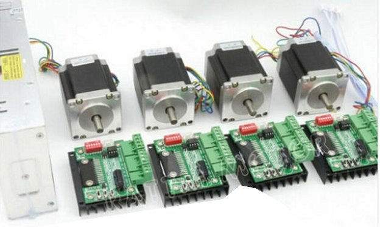](https://www.ebay.com/itm/193676837497)

The 76mm 23HS8430B Stepper motors provide plenty of torque for moving the axes around

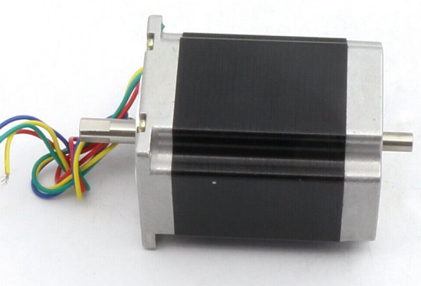

and I selected a smaller, [56mm stepper](https://www.ebay.com/itm/264779371700) for the z-axis,
that I also obtained on Ebay:

[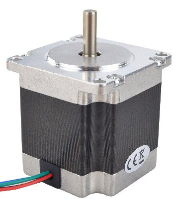](https://www.ebay.com/itm/264779371700)

## B. Z-Axis

I decided to use a store-bought pre-assembled metal Z-Axis that I found
[here](https://www.ebay.com/itm/144310475410)
on ebay.
This Z-Axis is substantially similar to the Z-Axes on my other CNC3018 machines,
but, instead of being made of plastic, like the one I printed for the 2nd machine,
this Z-Azis is made of anodized aluminum, which should be more rigid and precise.
It was light enough and cheap enough, for me, to ship it here, and doing so saved
considerable design efforts.

Still, after purchasing it, I had to create an accurate 3D model of it:

## C. Y-Axis

### Y-Axis Bearing

I performed a number of experiments to create linear bearings that
run on stainless steel tubes.  Initially I placed three regular ball bearings at
120 degree angles about the tubes, but found that that approach took
too much space. The design also evolved as I settled on the parallel plywood
approach to building the X and Y sleds.  In the end I decided to use
two different sized ball bearings, larger ones supporting the sled,
and smaller ones to keep it from moving side to side.

The large 8mm bolts provide both the structural integrity for the Y-Axis Sled,
as well as the shaft on which the main ball bearings ride.
The plastic parts are designed such that they fit perfectly into the plywood I use,
so that when the bolts are tightened, the 20mm washers on the bolts will
hold the side bearings in place, minimizing the amount of force that
borne by the 3D printed plastic.

### Y-Axis Sled

The Y-Axis Sled brings together four of the Y-Axis bearings
and two pieces plywood, with a
mount for a Nema 23 stepper motor and some idler bearings for the
belts, all of which provide a support for the Z-Axis.  Note that
this image also shows the adjustable Z-Axis limit switches.

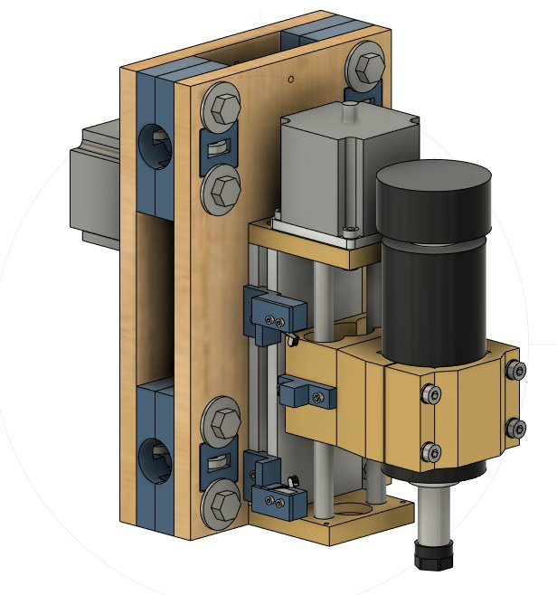

Many iterations with this and the subsequent X-Axis Sled design
were necessary to get good working positions for the tubes,
motor and idlers. The motors are placed so that they do not
collide with each other, and do not impinge on the travel
of the Y-Axis.

The belt wraps around as much of the
motor pulley as possible to prevent slippage, the
tubes are far apart to decrease the moment of twisting
between them, the belt is as close to the work surface
(as low) as possible, while still being between the two tubes.

## D. X-Axis

### X-Axis Bearing

For the X-Axis Bearings I settled on using one larger 8mm and two
smaller 5mm ball bearings in the Y arrangement as shown below.

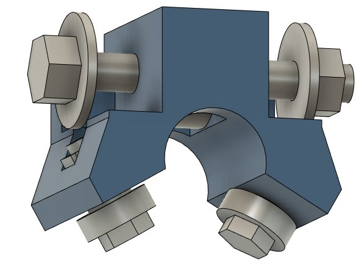

The X-Axis rides on top of the X Tubes.  Most of the force is
in transferred to the large 8mm bolts supporting the entire assembly
against gravity.   The nominal side forces, delivered through
the 5mm bearings and bolts and 3D printed plastic,
are relatively small by comparison.

### X-Axis Sled

Each X-Axis Sled brings together two of the X-Axis Bearings with
two sheets of plywood, and two Y Tube Connectors, with 8mm bolts,
to provide a rigid structure.

It mounts a Nema 23 stepper motor with a
pully, and has three idler bearings to route the belt through the sled.
Each X-Axis sled includes an adjustable Y-Axis limit switch and
two fixed X-Axis limit switches.

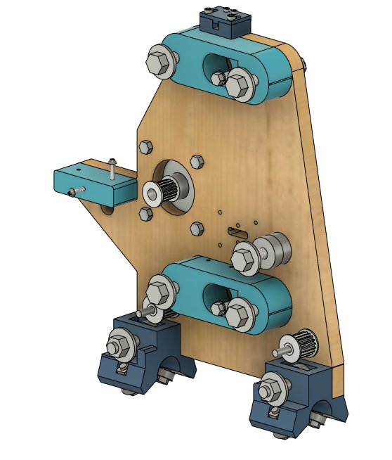

The other main sub-component of the X-Axis sled are the
*Y Tube Connectors* and *Y Belt Tensioners*.

### Y Tube Connectors

The Y Tube connectors are solidly bolted to the Y-Sled with large 8mm bolts,
and have a compression fitting and smaller 5mm bolt that will lock the tubes
in place.

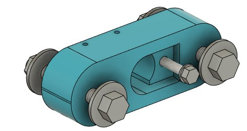

### Y Belt Tensioners

The Y Belt Tensioners are assymetical.  One side is used to adjust
the tension of the belt using an M3 screw mechanism, and the
other side is fixed, and is merely an anchor for the belt.

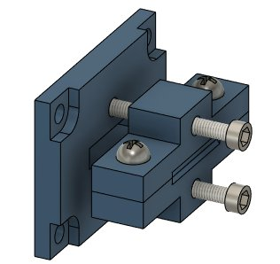
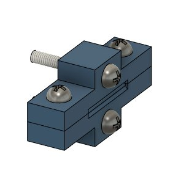

## E. General X Tube Design

The entire Y Axis assembly, the Z Axis, Y Axis Sled, two Y Tubes, two X-Axis Sleds,
all the stepper motors, limit switches, and associated wiring
... most of the complexity of the machine ...
is designed to be removable from the machine as a unit, leaving a relatively simple
base which consists, essentially, of the two X Tubes sitting on a bunch of
X Tube Supports, with a pair of X Tube ends at each side, with the X belt running
between them.

### X Tube Supports

The X Tube Supports are designed to be attached to the X Tubes with M3 machine
screws and **holes drilled and tapped** into the X Tubes themselves.  The
Supports, are, in turn, attached to the 1z6 runners with two M3 wood screws
each.

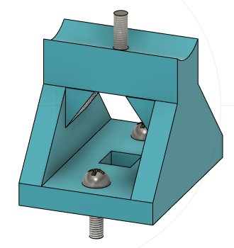

### X Tube Ends

The X Tube Ends provide addisional supports for the X Tubes as well as providing
the anchor and tensioning mechanism for the X belt.  They are mounted to the
base with four M3 wood screws each.  There is a fixed end on one side, and
an adjustable end on the other side.

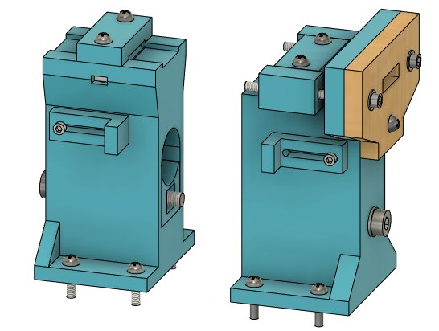

As with the Y Tubes, the X Tube Ends have a compression fitting and 5mm bolt that
will lock the tubes in place, and in addition each end has an adjustable stop
for the X limit switches.  I added a wooden 1/4" plywood piece to the adjustable
end after I found the belt tension was breaking that part.

## F. 4x4 Machine

The machine is designed to cut **at least** 4x4 feet, or 48x48 inches.
However, because I wanted to be able to cut cleanly outside the edges,
I ended up making a machine that has a work area of about 50.5" x 49".

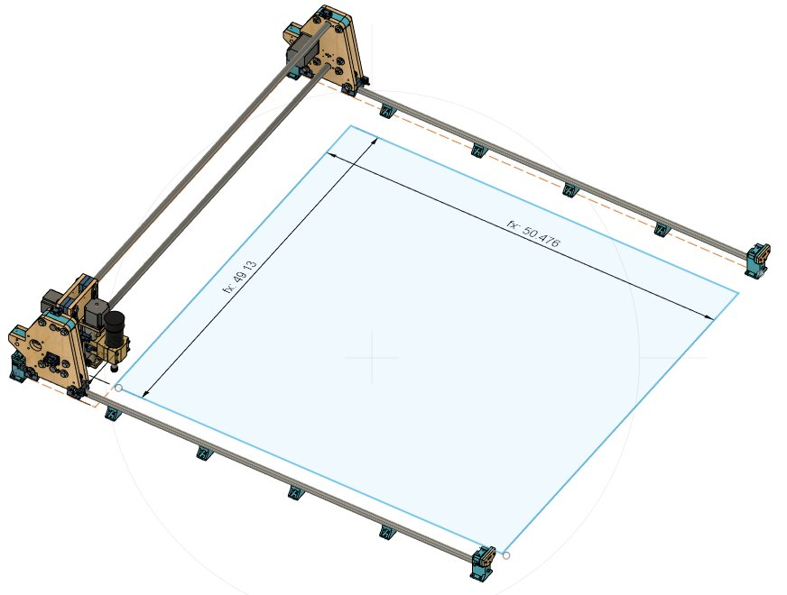

### Dimensions

The dimensions of the machine components were determined iteratively based
on a desire to make the table an exact number of **inches** for easier cutting
and building.
That is why most of the dimensiosn of the working parts
of the machine are not an integral number of inches or millimeters.
Once I decided that the table would be **62x62"** square, I worked backwards,
allowing 1/4" of space for the X-Ends from the edges of the table,
and allowing 2" of space for the X-Drag chain on the near side.

In the **parameterized design**, the *length of the tubes* drives everything
else

| Item                 | mm         | inches   |
|----------------------|------------|----------|
| X_TUBE_LENGTH        | 1552.1 mm  | 61.11 in |
| Y_TUBE_LENGTH        | 1505.5 mm  | 59.27 in |
|                      |            |          |
| X_CENTER_TO_CENTER   | 1449.9 mm  | 57.08 in |
|                      |            |          |
| X_TRAVEL             | 1282.1 mm  | 50.48 in |
| Y_TRAVEL             | 1247.9 mm  | 49.13 in |

### Table

Note that the X Tubes themselves are attached to a 1x6 "runner"
that is separately attached to the
table. This means that, theoretically, the remainder of the "machine" can be separated
from the "table" by removing those two boards, leaving you with a solid table that
is not actually specific to the machine (except in its general dimensions).

The table is big and heavy, around 120lbs.  The **legs** are *detachable* so that they can be moved
separately from the top and are attached by 3 x 1/4" **lag bolts**.

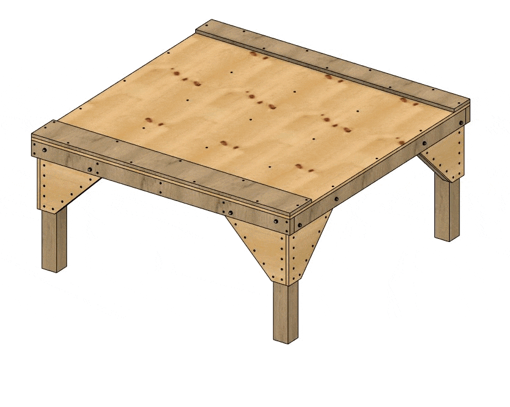

In the implementation, I did much of the work with the table top sitting on
the floor of my work area.    It was only after the machine was basically assembled
and proven that I added the legs and raised the top off the floor.

**Next** - Some Design [**Details**](details.md) for the machine ...
