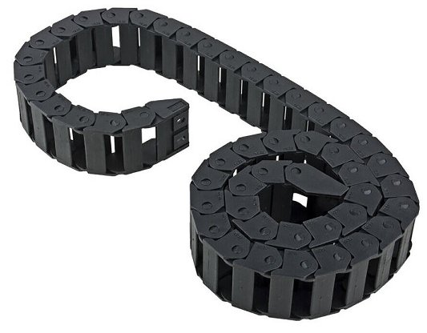

# esp32_cnc20mm - Design Details - Drag Chains, Connectors, etc

**[Home](readme.md)** --
**[Design](design.md)** --
**Details** --
**[Electronics](electronics.md)** --
**[Box](box.md)** --
**[Spindle](spindle.md)** --
**[Y-Axis](y_axis.md)** --
**[Table](table.md)** --
**[Build](build.md)** --
**[Laser](laser.md)** --
**[Accessories](accessories.md)** --
**[Software](software.md)** --
**[Notes](notes.md)** --
**[Projects](projects.md)**

## A. Drag Supports and Chains

There are two drag chains on the machine.

The X-Axis drag chain has **25 links**, lies on the table and connects to the X-Axis via the **X Drag Bracket**.

### X Drag Support

The Y-Axis drag chain has **45 links**, and lies on a piece of **plywood** that rides on the two X-Sleds, that
is additionally supported by a **2x2** between the sleds:

### Y Drag Support

The Y-Axis drag chain connects to the Y-Sled via a piece of **plywood**, supported by a 3D printed
**bracket**:

### Drag Chains

I purchased the [drag chains](https://www.ebay.com/itm/363509464282) by the meter on ebay.
The links are 38x16 mm internally and about 46 mm wide:

They are assembled onto the machine with **three M3x12 wood** screws at each end:

## B. Wire Clamps

In order to support the fixed set of wires that run to the far X-Sled, I designed and
3D printed the following **wire clamps**:

They are screwed into the **2x2** between the X-sleds with **M3x12** wood screws.

## C. Connector Brackets

I decided to make the cables for the entire machine **completely removable**.  They plug
into the [Box](box.md) with large 5.08mm Pheonix screw connectors, and are terminated on
the machine with sets of smaller [3.81mm Pheonix screw connectors](https://www.ebay.com/itm/313657760083):

In order to attach these *general purpose* connectors to the machine,
I designed and 3D printed sets of these little brackets to hold them.

There are **four**  3D printed parts that are screwed into the *Y Drag Support* on top of the **Y-Sled** that
provide **six** discreet connectors to the Y-Sled ...

- a **four** pin connector for the *Y Stepper Motor*
- a **four** pin connector for the *Z Stepper Motor*
- a **two** pin connector for the *Z Limit Switch*
- a **two** pin connector for the *Z Zero Switch*
- a **two** pin connector for the *Spindle Power* supply
- a **three** pin connector for the *Laser Power* Supply and *PWM* signal

.. and *one* 3D printed part that is screwed into each **X-Sled** that provides **two** discreet
connectors for each sled.

- a **four** pin connector forthe *X Stepper Motor*
- a **three** pin connector for the *X and Y Limit Switches*

This allows me to, for instance, unplug the **spindle* and replace it with the **laser**,
or, if I need to replace a stepper motor, I can merely **unplug it** and plug a new one
in.

Here's an image that shows how they are assembled:

**Next** - the **[Electronics](electronics.md)** and *PCB* (Printed Circuit Board) ...
