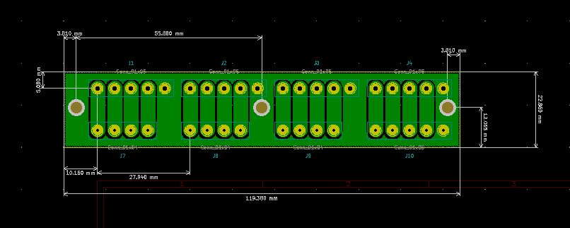
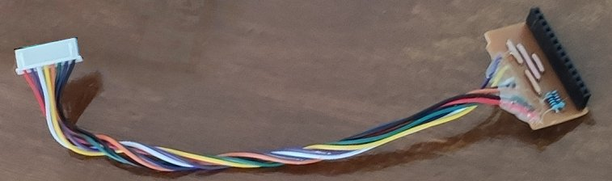
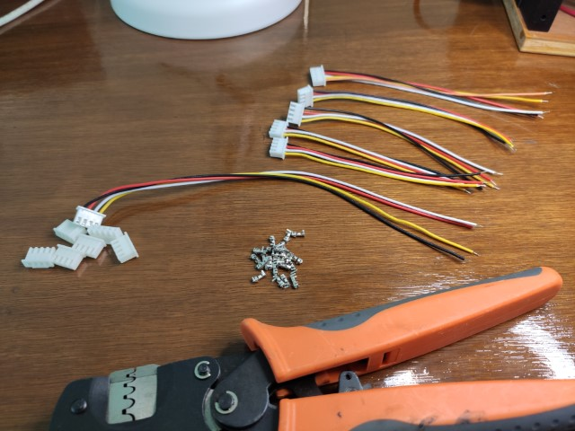

# esp32_cnc20mm - the Electronics and PCB

**[Home](readme.md)** --
**[Design](design.md)** --
**Electronics** --
**[Box](box.md)** --
**[Y-Axis](y_axis.md)** --
**[Table](table.md)** --
**[Build](build.md)** --
**[Accessories](accessories.md)** --
**[Laser](laser.md)** --
**[Details](details.md)** --
**[Projects](projects.md)**

This page describes the electrical components that I designed
and/or created that go into the [Controller Box](box.md), and includes the following:

- the [Schematic](#a-controler-schematic) for the Controller PCB (Printed Circuit Board)
- the [PCB Design](#b-controller-pcb-design) for the Controller
- the [Edge Connector](#c-edge-connector-pcbs) PCBs
- the [LCD Display](#d-lcd-connector) Connector PCB and cable
- the [USB Connector](#e-usb-connector) PCB and cable
- the [LED Strip](#f-led-strip) and cable
- the [SD Card](#g-sd_card_module) Module and cable
- other [Cables and Connectors](#h-other-cables-and-connectors)

## Version 4

Note that this is **version 4** of the controller.

The previous *version 3* was substantially more complicated
using a 74HC595 serial to parallel latch IC to drive
the stepper motors, and a 74HC`64 parallel to serial
latch IC to get the state of the limit switches, with
an initial design goal to minimize ESP32 pin usage and
take advantage of FluidNC's I2SOut scheme for driving
the stepper motors, and my own code to latch the limit
switch inputs.

After the initial implementation, I was having reliablity
problems with the stepper motors.  All of that complexity,
was coming at a cost.  So, by carefully choosing the pins,
and using ALL the available pins on the ESP32, I was able to
forego the latch ICs and redesign the circuit to just drive
the stepper motors, and get input from the limit switches,
directly with ESP32 pins, which significantly decreased the
complexity and increased the reliatbility of the circuts.

I did not take pictures of the completed v4 PCB.

I also did not film or photograph the making of either PCB.
Suffice it to say they were made in the way I usually make
my PCB's on my 3018 cnc machine, by milling them, coating
thej with UV epoxy and exposing the epoxy with a UV laser,
removing the unexposed epoxy then drilling the holes and
cutting out the boards.

## A. Controller Schematic

The Controller board has the following connectors:

- J1 is a **2 pin** connector for the raw **24V** input from the *Power Supply*
- J2-5 are four **4 pin** connectors for the *Stepper Motor* control outputs
- J6 and J7 are **4 and 5 pin** connectors for the *Probe and Limit Switches* inputs
- J8 is a **jumper** to connect the *Buck Converter* 5V output to the *ESP32*
- J9 is a **3 pin** connector the *LED Strip*
- J10 is an **8 pin** connector for the Touchscreen *LCD Display*
- J11 is a **3 pin** connector for the *PWM Output* to the laser (later)
- M2 is a **6 pin** connector for the *SD Card*

## B. Controller PCB Design

## C. Edge Connector PCBs

I decided to use large green **5.08mm Pheonix Style** connectors, in
conjunction with blue **5.08mm Screw Terminals**, to connect
the High Power Stepper Driver Boards to the Stepper Motors.
To mount these connectors in the Box I
designed and milled PCB's for them.

The PCB above shows how, due to electronic noise problems
(missed or sporadic steps) in the initial implementation,
I subsequently modified the design to use five pin connectors
so that each Stepper Motor cable has
a grounded shield in addition to the four A+, A-, B+, and B- pins.
The photos below show the original four pin Pheonix Connectors
before the modification.

There is also a similar smaller edge connector board to bring the
Probe and Limit Switch inputs to the outside of the box.

I used smaller JST connectors to connect the Limit Switch Edge
Connector PCB to the Main Controller PCB.

## D. LCD Connector

The LCD Display Connector is pretty much the same one as I used in my previous
two cnc machines.

## E. USB Connector

I decided to bring the ESP32's **USB Port** out to the front of the box
via a Type B Female USB connector.  The old *Type B USB* connectors,
that were typically used on games and larger devices, are much
more robust, IMO, than the *Micro USB* connectors on the ESP32.

To do this I created a small PCB to hold the female socket and
cut the end off of micro-usb cable and soldered it to the board.

## F. LED Strip

The LED Strip, consisting of five WS2812b LEDs, is soldered to a
wired **3 pin JST** connector.

## G. SD Card Module

The **SD Card Module** is soldered to 6 wires of a dupont cable,
and then replacing the individual black plastic pieces with a single
6 pin housing:

## H. Other Cables and Connectors

There are a variety of other **JST connector** cables that
are created in order to assemble the box:

- four **4 pin** cables to connect the PCB to the Stepper Motor Drivers
- two **4 pin** cables to connect the PCB to the smaller Probe and Limit Switch Edge Connector PCB

**Next** - the [**Controller Box**](box.md) ...
