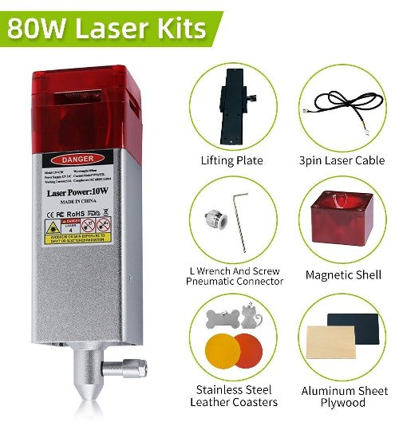
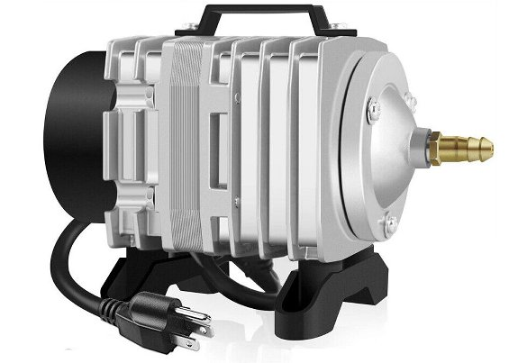
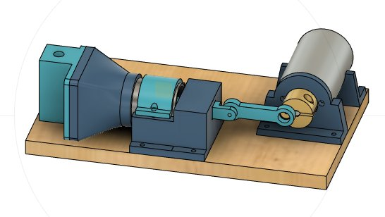
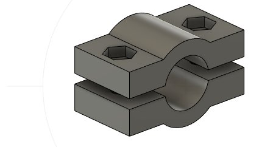
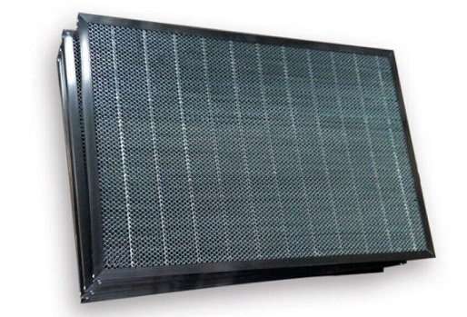

# esp32_cnc20mm - A bigger Laser!

**[Home](readme.md)** --
**[Design](design.md)** --
**[Details](details.md)** --
**[Electronics](electronics.md)** --
**[Box](box.md)** --
**[Spindle](spindle.md)** --
**[Y-Axis](y_axis.md)** --
**[Table](table.md)** --
**[Build](build.md)** --
**Laser** --
**[Accessories](accessories.md)** --
**[Software](software.md)** --
**[Notes](notes.md)** --
**[Projects](projects.md)**

As I initially designed the machine, I had ordered, and received a
5 Watt NEJE Laser
module.  While that laser was sufficient for *engraving*, fter doing a few
[projects](projects.md) using that laser, I decided it was woefully
underpowered and too wimpy for any serious *cutting* work.  With
*many passes* I could *barely* get it to cut through **1/8"** plywood.

I did some experiments to add a *jury rigged* **air assist** to it,
where one directs a pressurized stream of air at the cutting point,
which is supposed to make it cut cleaner, and more deeply, and
although those experiments *may* be worth a separate discussion,
in the end I decided to *throw in the towel* and go ahead buy a
**bigger laser** with a built-in air assist nozzle.

So, here I present **improvements** to the machine, having to
do with it's *laser* capabilities, that I **purchased on ebay**:

- [10W Laser Module](https://www.ebay.com/itm/234291227238)
- [Air Compressor](https://www.ebay.com/itm/373884754033)
- [Honeycomb Work Table](https://www.ebay.com/itm/134220198553)

Note that, as of this writing, I am *considering* yet another upgrade
to a **multi-diode** laser with an output power in the 20W range

## A. 10W Laser Module

They advertise these as **80W**, which is, perhaps the *input power*, but
in general, diode laser advertisements are *stupid and misleading*.
NEJE advertised my previous *5W* laser as  *20 watts*!  Notice than
on the below photo, they advertise it as 80W but it clearly shows
that it is **10W** of output power on the sticker on the laser:

One nice thing about this particular module is that, unlike my previous NEJE 5W
module, which had a *weird housing* that was *off center* and *did not fit* into the
clamp of the Z-Axis, **this module fits** more or less perfectly into the
existing Z-Axis, and is approximately **centered** so that the *beam* hits
the same point as the center of the *spindle*, meaning that only a minor
adjustment is needed if I want to align laser cuts with milling.

It is also powerful enough to cut through **3/16" plywood** in two passes,
with good results, or through *1/4"* in three passes with useable results.
I actually got it to cut through *1/2"* one time in some experiments,
with about a dozens passes, but the convergence of the beam is not that great and
the result was generally **charred** and unusable.

## B. Aquarium Air Compressor

I don't have a **shop compressor**, and did not want to buy one just for this
purpose.  There are **purpose built** compressors for Lasers but, IMO they
are overpriced due to the limited number that are produced and sold.
So, in order to provide air to the built-in nozzle on the laser, I decided
on this inexpensive [Aquarium Air Compressor](https://www.ebay.com/itm/373884754033).

While I was waiting **1.5 months** for the compressor to get here from China,
I built and tested a **3D Printed** Air compressors.  It worked but did not
perform particularly well, so I ended up using the store-bought compressor
instead.

When the compressor finally arrived, in order to connect the tubing I had to it, I
*3D printed*s the following **hose clamp**:

## C. Honeycomb Laser Table

One thing that becomes quickly apparent when cutting wood with a laser
is that you **don't** want it laying directly on top of another piece of wood
(the wasteboard) when you do so.  If so, then when the laser burns through
your workpiece, it continues burning into the waste and noticably **marks**
the bottom side with smoke and burn stains.

Therefore I purchased this **630x430mm**
[Honeycomb Work Table](https://www.ebay.com/itm/134220198553),
for about $45,
specifically for **cutting** things with the laser:

The actual *working area* on this table, though advertised as 24x16, in reality is an
*unhandy* **23x15.25 inches**, due to the frame.  It would be *much better* if it was
slightly larger with an actual working area of *24x16 inches*, especially since
the most common lumber to be cut are 4x8 foot sheets of plywood

As a result, the wood blanks I cut, for this are 23x15 inches, which determines the maximum
size of the wood I can laser cut with this machine.  I could buy a larger honey comb, but
they are pricy ($200 for a 500x1000mm or about 2x3 feet) and **very heavy** to ship.
In the meantime I will think about other ways to achieve the goal using locally sourced
materials.

**Next** - Various [**Accessories**](acessories.md) for the machine ...