# Rudimentary initial page for the cnc20mm machine

The cnc20mm machine is based on stainless steel 20mm tubes and 3D printed linear bearings that
utilize small inexpensive ball bearings.

It uses these items because it is prohibitively expensive to ship the "real" parts that one would
use to create such a machine to Bocas Del Toro, Panama.

It is intended to scale up to a machine that can cut (and laser) 4x8 sheets of plywood.

The initial incarnation will likely cut 3x6 feet due to space limitations in my work area.
That machine will actually be 4'6" by 7' in size!

It uses 15mm belt drives and Nema23 motors.  These motors are larger than my previous machines
and so it requires larger higher power controller boards.   It's kind of like boats ... doubling
the size requires 4 or 8 times the size of the individual components (square or cube law of
masses ... elephants are much more difficult to construct than mice).

## Basic setup

The basic setup revolves around the Y and Z axes.    Here is a idea of how a 3x6 machine would look.
To cut 3x6 feet requires a machine that is actuall 4x7 feet, about as big as I can fit in the apartment.

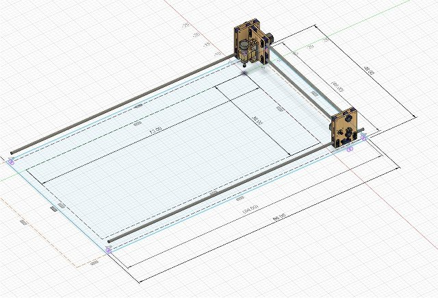

Here is the CAD drawing of the YZ axis:

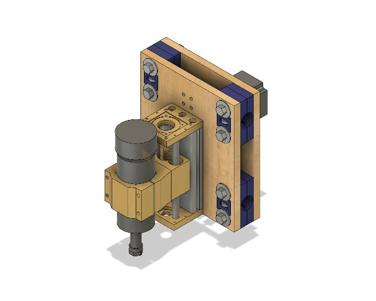

And here is a drawing of one of the X axis units:

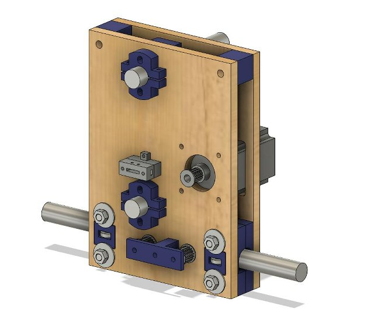

## 3D printing and wood cutting

I 3D printed a bunch of parts.  It took weeks, if not months, to ensure that I had all the correct
hardware, nuts and bolts, etc, here in Bocas.

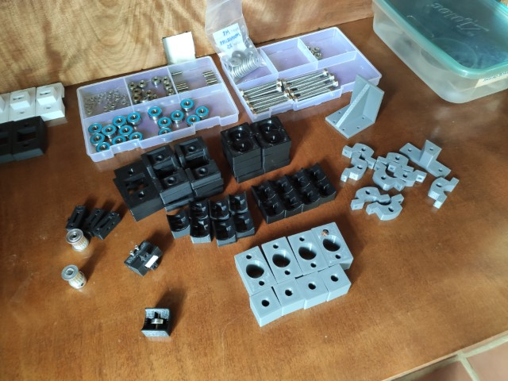

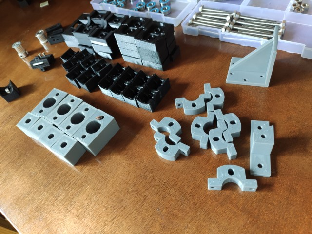

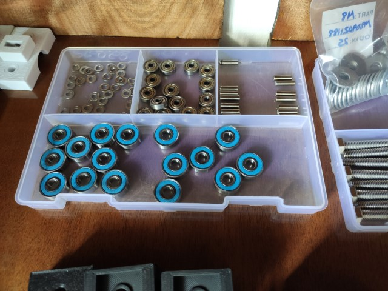

I cut the wood pieces out of locally sourced (read: low quality) "1/2 inch" plywood.
It's actually about 11.5mm, or about 0.45" ...

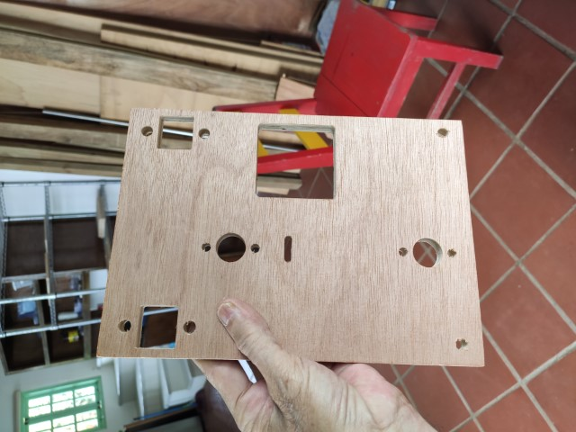

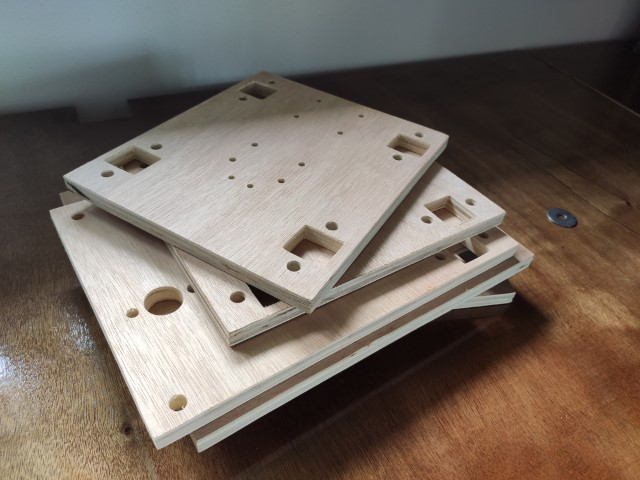

Here's some pics of the assembly:

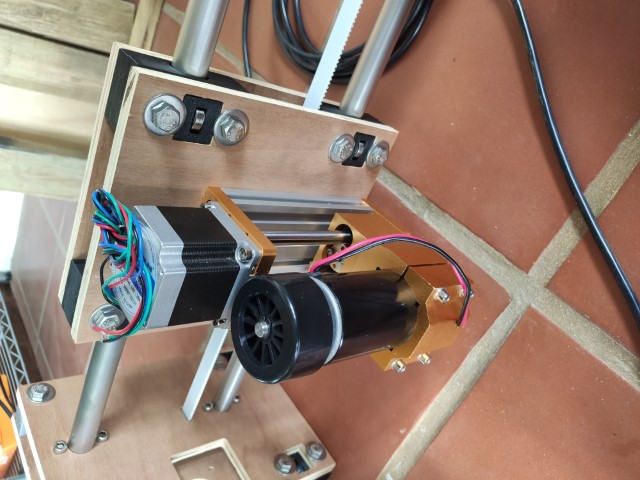

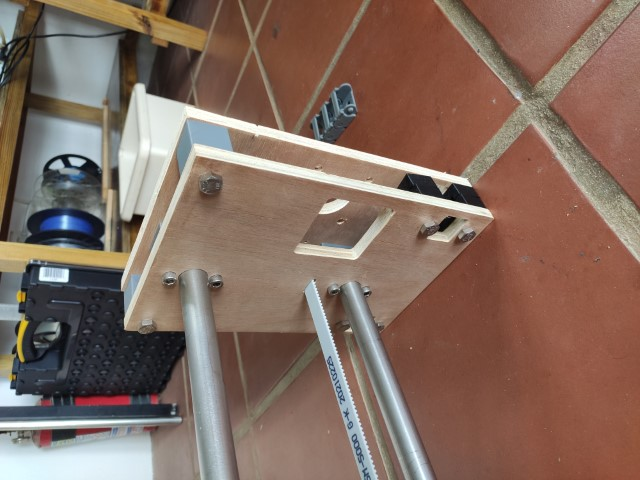

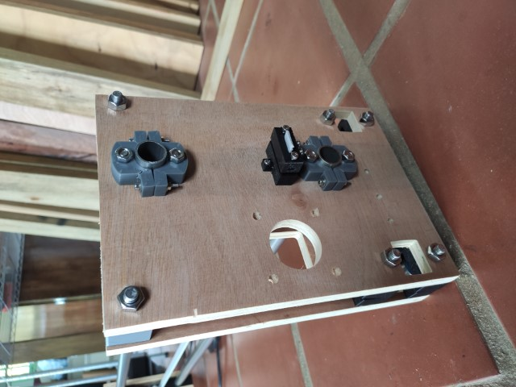

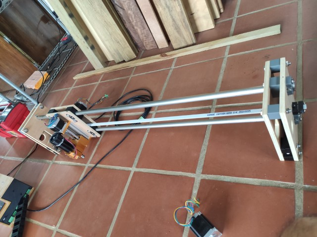

## The Controller box

The controller box ended up being nearly as complicated as the machine itself.

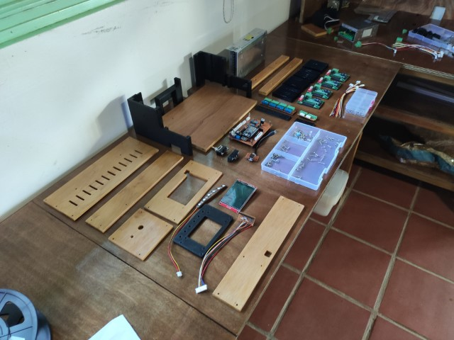

I designed, cut, epoxied, soldered, and tested the PC board:

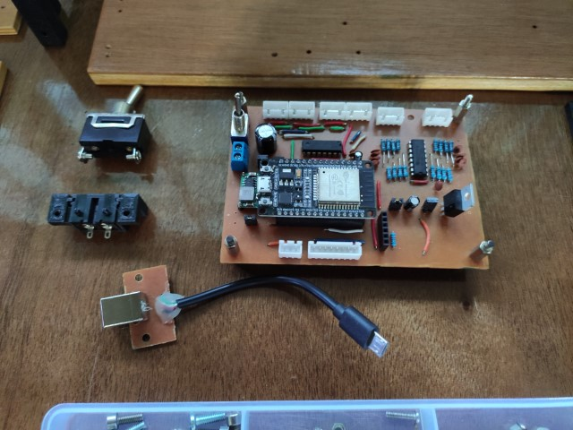

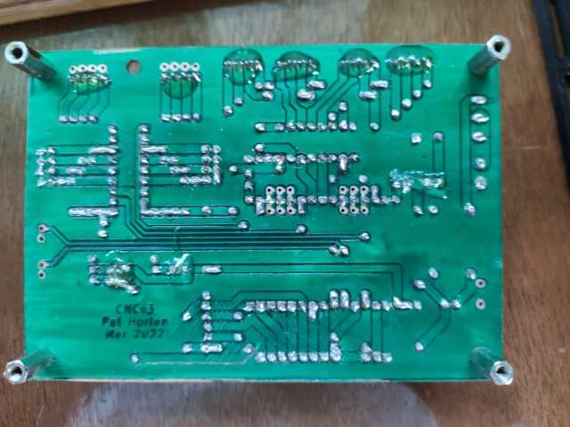

But the hard part was to fit the controller boards and power supply into a box.

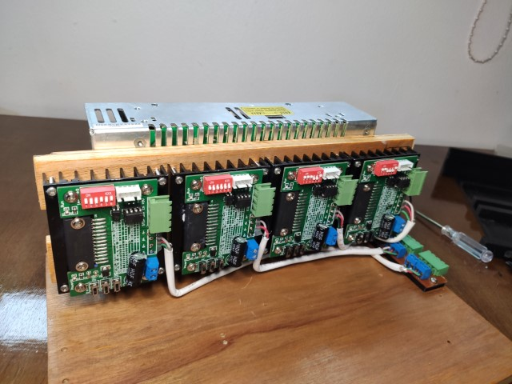

So, once again I cut a bunch of wood and 3D printed a bunch of plastic.

[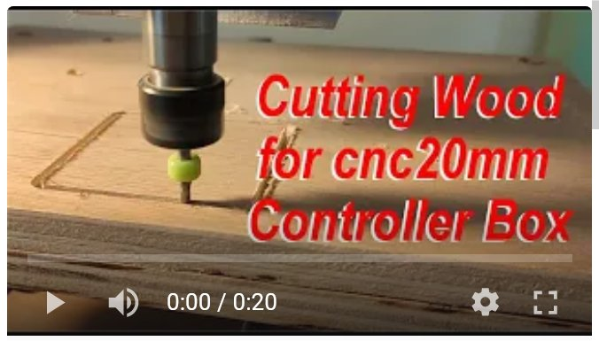](https://youtu.be/6celfyUNYEE)

I also covered this wood with a quick coat of polyurathane.

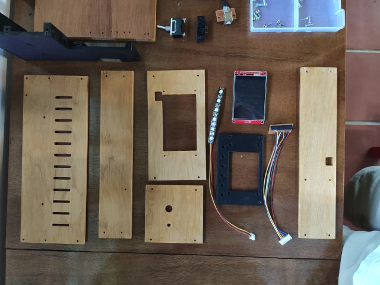

There are many additional small PCB's and cables that I made ... the power harness,
two PCBs for the external connectors,
one for the touch screen connector, one for an external USB connector, one for the SD Card,
and all the little cables were hand made:

Power Harness:

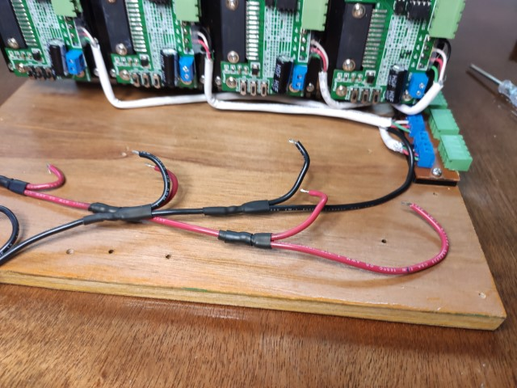

SD Card Adapter

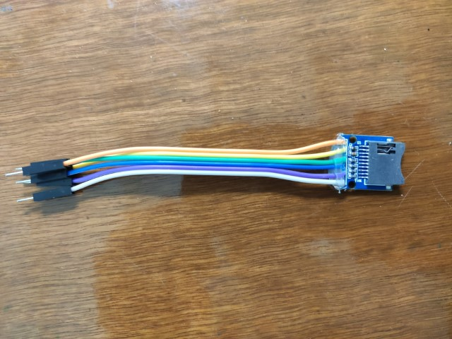

Touch Screen Connector:

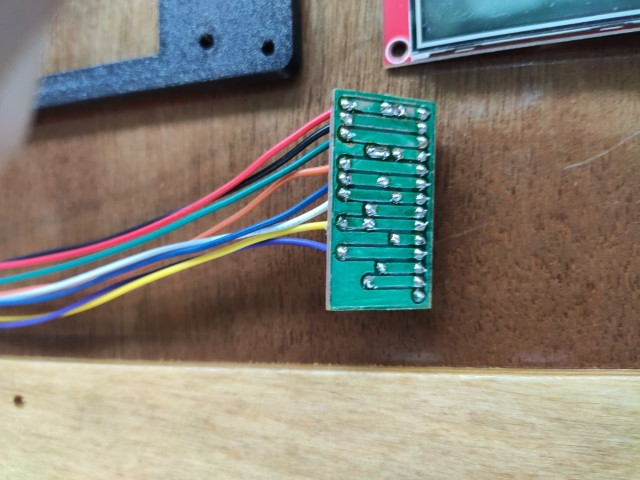

USB Connector

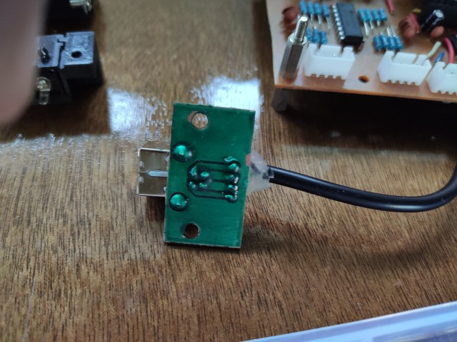

Various Custom (crimped) cables:

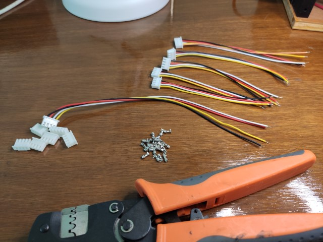

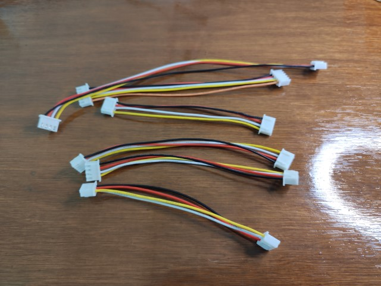

Power Supply Switches

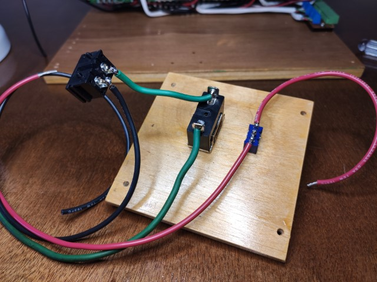

Here's some various pics of the the assembly process.

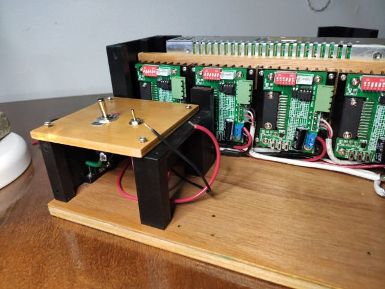

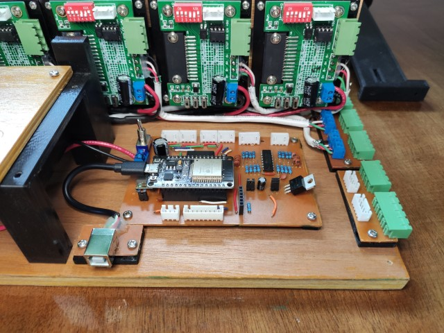

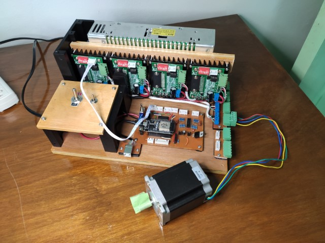

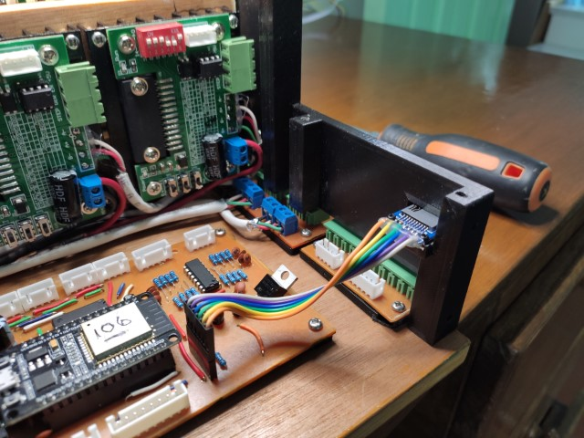

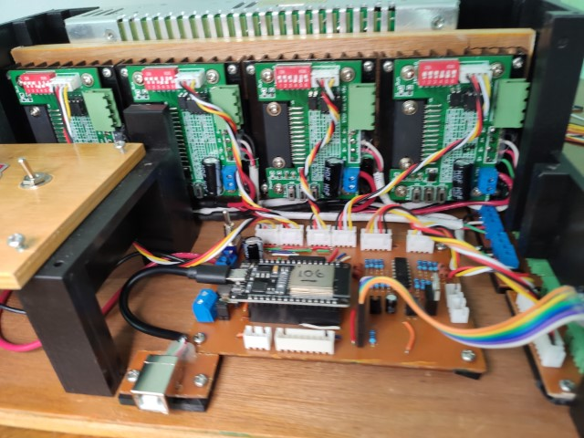

And the finished box:

## Initial test run of Y Axis

As of this writing, here is the run of the 3 foot Y axis sitting on the floor of the apartment:

### More Later ....

