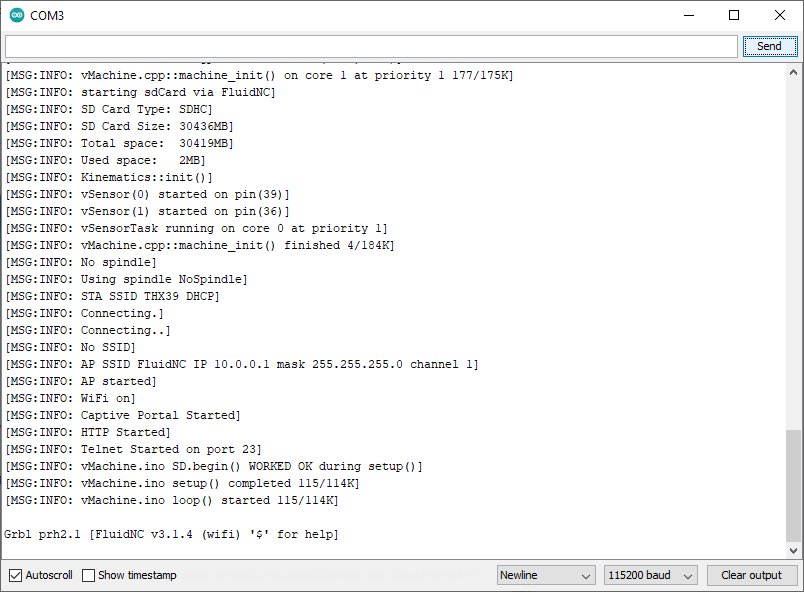
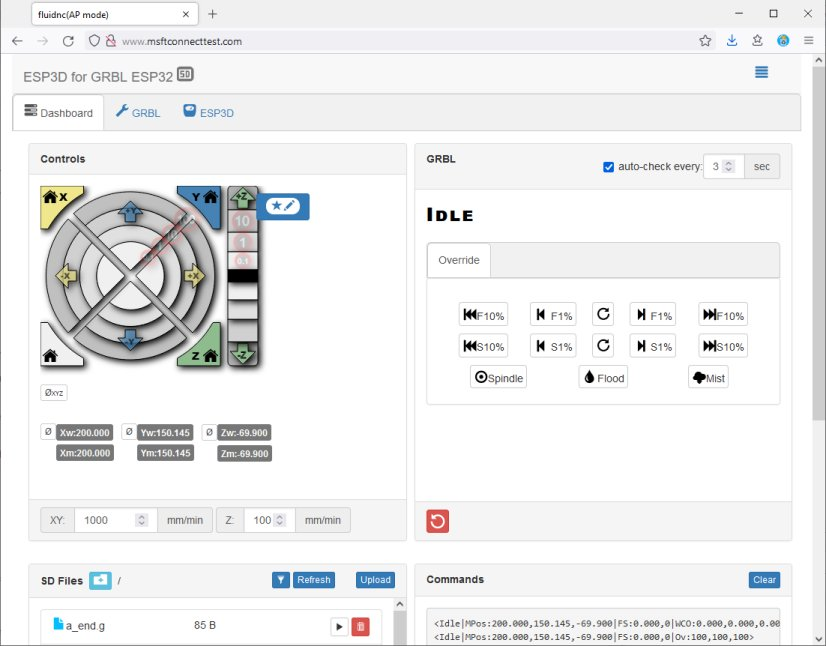
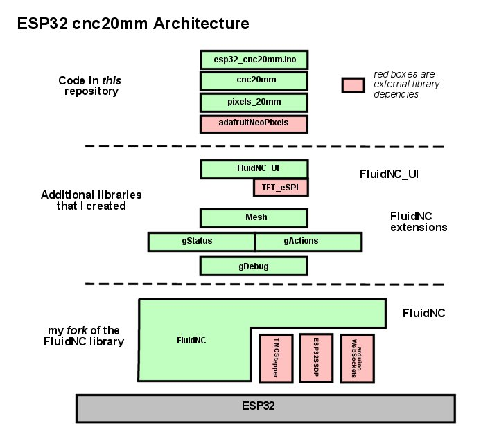

# esp32_cnc20mm - Installing and Brief Overview of Software

**[Home](readme.md)** --
**[Design](design.md)** --
**Details** --
**[Electronics](electronics.md)** --
**[Box](box.md)** --
**[Spindle](spindle.md)** --
**[Y-Axis](y_axis.md)** --
**[Table](table.md)** --
**[Build](build.md)** --
**[Laser](laser.md)** --
**[Accessories](accessories.md)** --
**Software** --
**[Notes](notes.md)** --
**[Projects](projects.md)**

This page describes the
[Installation](#a-installation)
and
[Architecture](#b-architecture)
of the software both of which are essentially identical to
the information presented in my previous
[cnc3018](https://github.com/Arduino-esp32_cnc3018) and
[vMachine](https://github.com/Arduino-_vMachine) projects.

We then go a little deeper into this instance of the archicture
by taking a more detailed look at the software, specifically
an analysis of the ESP32
[Task Management](#c-esp32-tasks), the methods used for
[Serial IO](#d-serial-polling), and a brief look at how
[Limits](#e-how-limits-are-checked) and how they are checked
within the program.


## A. Installation

Some of these instructions are duplicated on and/or reference other pages.
Please follow the links as needed to download and install the various pieces.

### 1. Prepare the Arduino IDE

- install the [**Arduino IDE**](https://www.arduino.cc/en/software)
- add the [**ESP32 board**](https://docs.espressif.com/projects/arduino-esp32/en/latest/installing.html)
  to the Arduino IDE using the *Boards Manager*
- add the [**Arduino ESP32 filesystem uploader**](https://github.com/me-no-dev/arduino-esp32fs-plugin)
  to your Arduino Sketch "tools" folder

### 2. Get the Source Code

Start by copying or cloning **this repository** into a folder called **esp32_cnc20mm**
within your Arduino Sketch folder.

You then need to add a number of libraries to your **Arduino/libraries** folder.
Some of these libraries have additional dependencies on other libraries.
Please follow the instructions on the linked pages to install each library and it's dependencies.

- install my version of the [**FluidNC**](https://github.com/phorton1/Arduino-libraries-FluidNC) library and it's dependencies
- install my [**FluidNC_Extensions**](https://github.com/phorton1/Arduino-libraries-FluidNC_Extensions) library
- since the machine is built with the TFT Display you need to install
  my [**FluidNC_UI**](https://github.com/phorton1/Arduino-libraries-FluidNC_UI) library
- and since we the machine is built with ws2812b LEDS you need to install
  the **Adafruit Neopixel** library using the Arduino *Library Manager*

### 3. Build/Flash the Firmware and upload the SPIFFS

- open the **esp32_cnc20mm.ino** sketch in the Arduino IDE
- select the **ESP32 Dev Module** board from the Arduino *Tools-Boards* menu
- select the **Minimal SPIFFS** (1.9MB App with OTA/190KB SPIFFS) from the *Tools-Partition Scheme* menu
- select the correct **COM Port** for the ESP32
- build and upload the firmware to an ESP32 using the Arduino IDE **Verify/Compile/Upload** commands
- upload the contents of the *data folder* to the ESP32 *SPIFFS* using
  the **Tools - ESP32 Sketch Data Upload** command

### 4. Access the machine via the Arduino Serial Monitor

You should now be able to open the Arduino Serial Monitor (set it to **115200 baud**) and access the machine
via the USB serial port.  You should see something like this:



You can now send GRBL (Gcode) commands to the machine by entering them into the
Arduino Serial Monitor and pressing the **Send** button.  Each time you press the
Send button, the machine should reply with **ok** in the Serial Monitor.

### 5. Format and prepare a FAT32 SD Card

Assuming that you are using the SDCard, please prepare one
by formatting it as necessary.

- The size of the SD Card is not very important.
- The machine can handle up to 32GB cards.
- Some work better than others.
- If at first it doesn't work, try turning everything off and
on, and re-inserting it the SD module.
- If you can't get it working, try a different SD card.

You can put files on the SD Card with your computer. You can also
connect to the ESP32 via Wifi and upload/delete files from the SDCard
using the **Web UI**.   You can *list* and *run* files on it from the
**Serial Port** via the *$sd/list* and *$sd/run=* commands,
or via **Touch Screen UI** *Files* window.

### 6. Connect to the machine with the Web UI

By default the machine will present itself as a Wifi Access Point called **FluidNC**

- connect your computer or phone to the **FluidNC** Wifi Access Point
- the default password is **12345678**

As soon as you connect to the FluidNC access point, a browser should pop up
and you should see the Web UI for the machine:



If that does not happen, you ***may*** be able to access it, once connected,
via the default IP address of **10.0.0.1**.

### 7. Configuring the Wifi

There are a number of commands that you can use to configure
WiFi access to the machine.

You can make it connect to your
existing Wifi network by issuing the following commands:

```yaml
$Sta/SSID=YOUR_NET_SSID
$Sta/password=YOUR_NET_PASSWORD
```

You can then connect to it using the IP address given by your router,
which you can see either in the Serial Terminal Window at startup,
or at the top, in the Title Bar, of the Touch Screen UI.

It is beyond the scope of this page to describe all of the commands
and techniques that you can use to configure and modify the machine.
But if you have gotten this far, you can see there
are a number of different approaches available.

### 8. Finished!!

**Congratulations!  You now have prepared the firmware for a esp32_cnc20mm machine!**


<br><br>
## B. Architecture



The above diagram gives a birds-eye view of the architecture of the
software for the machine.

At the top, the *code in this repository* includes
the main *Arduino Sketch* **INO** file which
implements the usual Arduino *setup()* and *loop()* methods.

Below that the **cnc20mm** layer/component *(cpp file)* contains the
**glue** (mostly overridden *weakly bound* methods) to **FluidNC**.
Most of the machine specific functionality is implemented in this
component.  It initializes the (optional) **pixels** below it,
and if included in the build, the lower level *FluidNC_UI* and
*FluidNC_exensions **Mesh*** features.

Below the *dotted line* in the digram are the other libraries and
code used by the my FluidNC based cnc machines.

In my architectural diagrams **visibility**
is connoted vertically in **layers**, and within layers there are
**components**. Typcially, but not always, *components* are synonymous
with C++ *classes*.
Things higher in the diagram *can see* (know about) the components and
layers below them, but things in lower layers cannot see (do not know about)
things above them.  Components at the same level in the diagrams have *varying
degrees* of visibility of one another, depending on the detailed design.

The machine makes use of my
[**FluidNC_Extensions**](https://github.com/phorton1/Arduino-libraries-FluidNC_Extensions)
library and my
[**FluidNC_UI**](https://github.com/phorton1/Arduino-libraries-FluidNC_UI)
library  The FluidNC_UI library is in turn, dependent on the
[**TFT_eSPI**](https://github.com/phorton1/Arduino-libraries-TFT_eSPI)
library which is shown in **red**.
Within the FluidNC_Extensions library there are a number
of components including the **gStatus**, **gActions**, and **gDebug**
objects and methods.

Below the seecond *dotted line* is
[**my fork**](https://github.com/phorton1/Arduino-libraries-FluidNC)
of the **FluidNC** project
repository.  The bulk of the actual functionality of the machine is
provided by this library.  It in turn depends on the **TMCStepper**,
**ESP32SSDP**, and **arduinoWebSockets** libraries.

And finally, at the bottom of the diagram is the **ESP32** hardware,
abstracted into a single box.


### 1. esp32_cnc20mm.ino

**esp32_cnc20mm.ino**, as expected, contains the usual Arduino **setup()**
and **loop()** methods.

They more or less simply call the corresponding
**main_init()** and **run_once()** methods from *FluidNC*.

There is a little bit of additional code in esp32_cnc20mm.ino to
optionally *initialize the SD Card* and *pixels*.  I found that initializing
the SD Card the very first thing in the program tends to be
the best, as the SDCard does not play well with other *SPI*
devices until it has been properly initialized.

### 2. cnc20mm.h and cpp

**cnc20mm.cpp** contains the *glue* to FluidNC which takes the form
of a number of overriden *weakly bound* methods, including:

- **display_init()** - called early from FluidNC during the call to *main_init()*
- **machine_init()** - called from FluidNC during the call to *main_init()*

### 3. pixels20mm.h and cpp

Contain a thin wrapper around *adafruitNeopixels* along with
a **task** that updates a ws2812B LED strip in terms of the
state of the limit switches, probe, and overall system state.


<br><br>
## C. ESP32 Tasks

**Task Management** on the ESP32 within the *FluidNC* program and this architecture
is **not** trivial.  Serious efforts were put into analyzing the *Task Usage* by
the software to ensure that the most important time critical code (i.e.
sending pulses to the **stepper motors**) is not impeded by other tasks,
whether the tasks are created within the FluidNC libraries (like the **gDisplayTask**
which updates the touch screen display), or by the *hidden* tasks within the
**ESP32 libraries**.

There are **two cores** on the EPS32.  **Core 1** is used by the ESP32 libraries
and includes the calls to the Arduino **setup() and loop()** methods, as well
as any other **hidden tasks** used in those libraries.  Core 1 is also considered
the **default core** if no *core parameter* is passed into the task creation methods.

**Core 0** is *unused* by the ESP32 libraries, and in my architecture is used for
the as many *other tasks* in the system as possible.  Note that we need to run
the **gDisplayTask** on the same core as the ESP32 libraries due to some deep
issue in the TFT libraries.

*Not all possible tasks are **compiled in** or **instantiated** by default.*
A number of tasks are implemented in the code, but **not compiled in**
based on compiler defines. And some other tasks are not **instatiated**
because we don't *use those features* in our YAML file.

```Perl
# on    pixelTask         priority:1 stack:4096  core:0           in pixels_cnc20mm.cpp
# on    gDisplayTask      priority:1 stack:10240 core:default(1)  in FluidNC_UI.cpp                must run on on default core
# out   screenGrabTask    priority:1 stack:8192  core:0           in FluidNC_UI/gScreenGrab.cpp    compiled out due to #if WITH_SCREEN_GRAB
# out   limitCheckTask    priority:5 stack:2048  core:default(1)  in FluidNC/gLimits.cpp           compiled out due to #ifdef LATER
# off   I2SOutTask        priority:1 stack:4096  core:1           in FluidNC/I2SOut.cpp            off unless an ISSO pin is used in the YAML
# off   shiftInTask       priority:1 stack:4096  core:1           in FluidNC/Machine/i2SIBus.cpp   off unless an I2SI pin is used in the YAML
# out   monitorI2SInTask  priority:1 stack:4096  core:1           in FluidNC/Machine/I2SIn.cpp     compiled out due to #ifdef MONITOR_I2S_IN
# off   servoUpdateTask   priority:1 stack:4906  core:1           in FluidNC/Motors/Servo.cpp      only used by Servo Motors and Dynamixel Stepper motors (not by RMT)
```


<br>

## D. Serial Polling

The FluidNC library does **not** have a task to handle serial IO.
It is purely called by **polling** from the main gcode machine **protocol_main_loop()** method.


**In protocol.cpp:**

```C
Serial.cpp::pollClients(realtime_only)
    // called with false ONLY from top of protocol_main_loop()
    // report_status_message(execute_line until there is room to give the line to the gcode interpreter
    // and otherwise, called with TRUE
    //    from protocol_do_alarm() on soft or hard limit
    //    and protocol_exec_rt_system() while waiting for line to execute or next line to be available

// psudocode:
//	for (auto client : clientq)
//	        auto source = client->_in;
//        	int  c      = source->read();
//		realtime-commands
//            	if (realtime_only)
//            		log_error("Only realtime commands are allowed");
//                	client->_linelen = 0;
//                	continue;
//		add to linebuffer
//		display("GCODE", client->_line and returns client if line is ready
//
//	if (realtime_only)
//        	return NULL;
//
//	WebUI::COMMANDS::handle();  // Handles feeding watchdog and ESP restart
//	WebUI::wifi_services.handle();  // OTA, web_server, telnet_server polling
//
//  if (sdcard && sdcard->_readyNext) {
//      return sdcard->getClient() if line returned OK
//      report error if not
//
//  return NULL
```

So, the WebUI only does "realtime commands" while a gcode line is pending and/or a
"job" is running.


<br>

## E. How Limits are checked

```C
	void IRAM_ATTR Stepper::pulse_func()
		// is the main workhorse it calls probe::tripped() if probing

	// limit pins are attached to change ISR's
	//     and directly call mc_reset() (if not homing, etc) and
	//     and set rtAlarm = ExecAlarm::HardLimit
	// I2SI limit pins are "read" by shiftIn task at 100Hz if use_shift_in
	//     or at 1Mhz? if by DMA if !use_shift_in
	//     and call the interrupt handlers as if they were real pins,
	// Ergo, the shiftInTask (use_shift_in) is needed
	//     or the DMA interrupt is even more processor intensive.
	//     BUT none of this is in the UI
```

<br><br>

**Next** - some early [**Projects**](projects.md) made using the machine ...