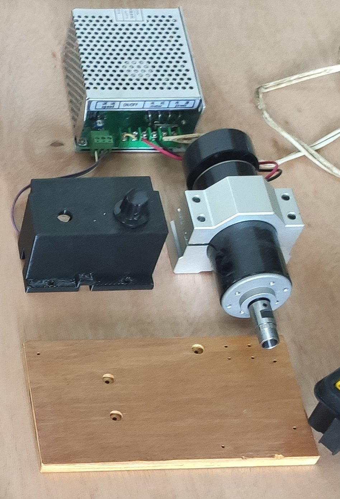

# esp32_cnc20mm - Spindle Controller Box

**[Home](readme.md)** --
**[Design](design.md)** --
**[Details](details.md)** --
**[Electronics](electronics.md)** --
**[Box](box.md)** --
**Spindle** --
**[Y-Axis](y_axis.md)** --
**[Table](table.md)** --
**[Build](build.md)** --
**[Laser](laser.md)** --
**[Accessories](accessories.md)** --
**[Software](software.md)** --
**[Notes](notes.md)** --
**[Projects](projects.md)**

I purchased a 500W Spindle and Power Suppl, and designed
this box around it.  I decided to keep it separate from the main
[CNC Controller Box](box.md) in case I wanted to change to a different spindle
in the future:

The box has a milled plywood bottom and a 3D printed cover.
The [kit that I purchased](https://www.ebay.com/itm/264540305538)
on eBay included a variable 100V DC power supply with a separate
*rheostat* controller:

As with the [controller box](box.md), I made a small **PCB board** to hold a two pin, 5.08mm
**Pheonix connector**.

And, after adding an old **lamp cord** and **on/off switch** ...

.. I assembled it as follows:

**Next** - Building the [**initial Y Axis**](y_axis.md) for the machine ...
