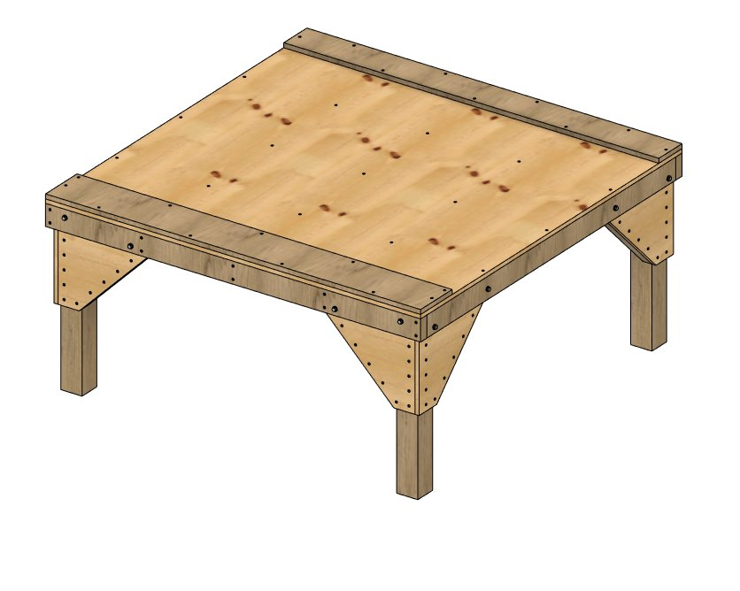
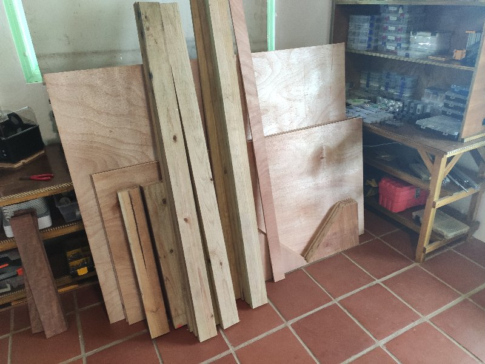
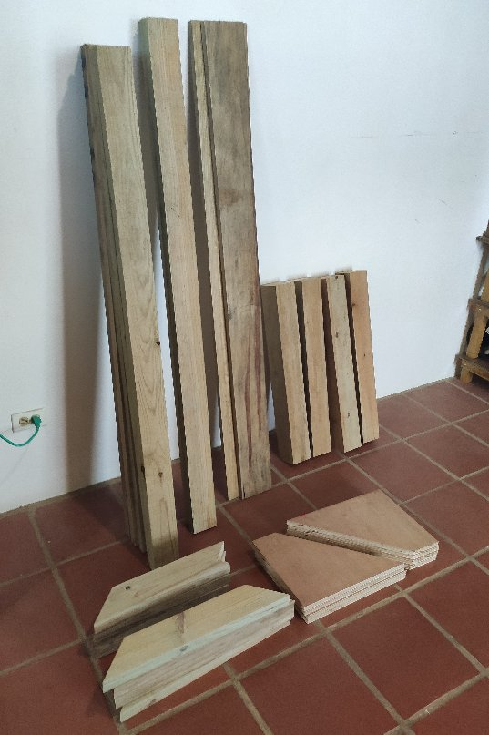
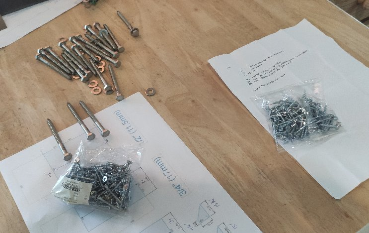
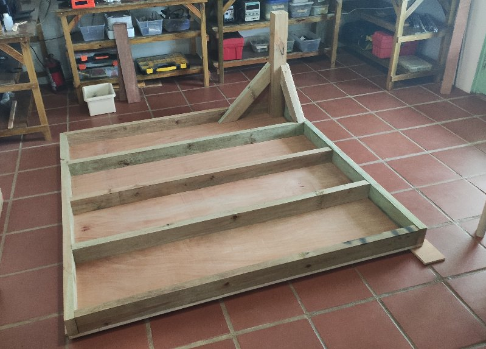
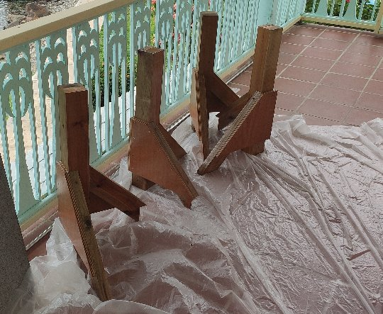
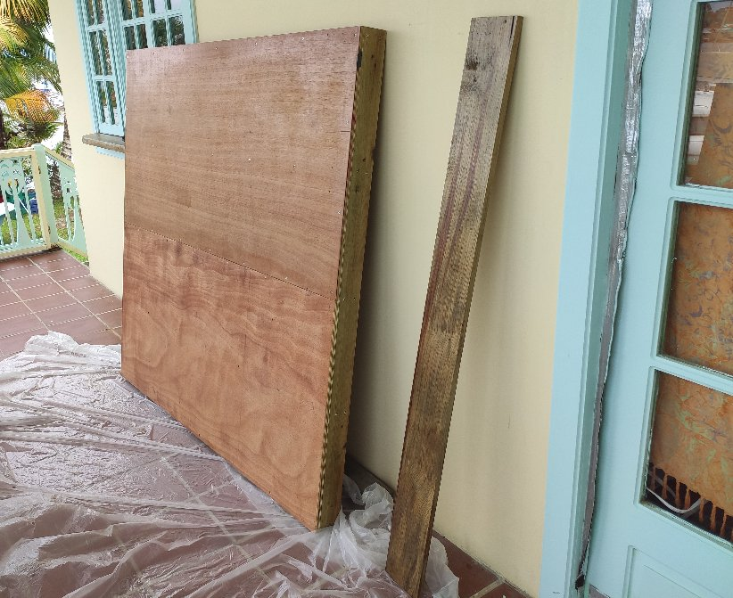

# esp32_cnc20mm - Building the Table (furniture)

**[Home](readme.md)** --
**[Design](design.md)** --
**[Details](details.md)** --
**[Electronics](electronics.md)** --
**[Box](box.md)** --
**[Spindle](spindle.md)** --
**[Y-Axis](y_axis.md)** --
**Table** --
**[Build](build.md)** --
**[Laser](laser.md)** --
**[Accessories](accessories.md)** --
**[Software](software.md)** --
**[Notes](notes.md)** --
**[Projects](projects.md)**

This is one solid, and heavy, table !!

First we gathered all the lumber. I say **we** loosely!  In fact **Israel**, my worker and friend,
actually made the trips, by *boat* to *get* the wood, then **cut** it all, and actually
constructed the table.

With regards to the table, my job was largely to print out **detailed plans** that Israel could follow,
explain them to him, and monitor his progress on the **sub-project**.

We locally sourced the metal hardware, **1/4" lag bolts** and **drywall screws**:

After constructing the table face down on the floor with **glue and screw**, the legs are assembled,
one at a time, *drilled and screwed* together for a *dry fit*, then removed and disassembled
and separately **glued and re-screwed** together to make very solid structures.

Once again, the *legs* are attached to the *top* with **four** stainless steel **1/4" by 3" lag bolts** each!!

Because I/we live in the tropics, whenever we make a wooden project, we do our best to seal it
against the elements.  In this case we (Israel) applied 3 coats of clear **polyurthane** to seal
the wood, particularly the edges of the plywood.

Work on the machine itself proceded with the **table top**, without any *legs*, sitting on the
floor of my work area.

**Next** - [**Building**](build.md) the actual machine ...