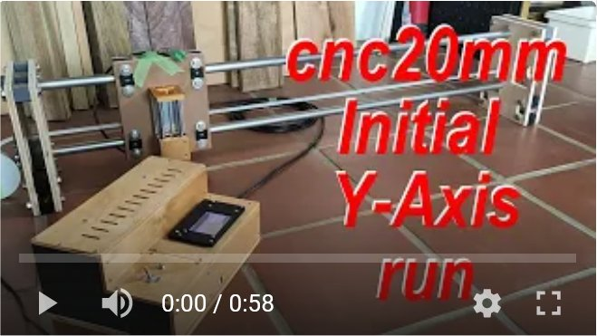

# esp32_cnc20mm - Initial Y Axis

**[Home](readme.md)** --
**[Design](design.md)** --
**[Electronics](electronics.md)** --
**[Box](box.md)** --
**Y-Axis** --
**[Table](table.md)** --
**[Build](build.md)** --
**[Accessories](accessories.md)** --
**[Laser](laser.md)** --
**[Details](details.md)** --
**[Projects](projects.md)**

## Initial test run of Y Axis

As of this writing, here is the run of the 3 foot Y axis sitting on the floor of the apartment:

**Next** - Building the [**Table**](table.md) for the machine ...