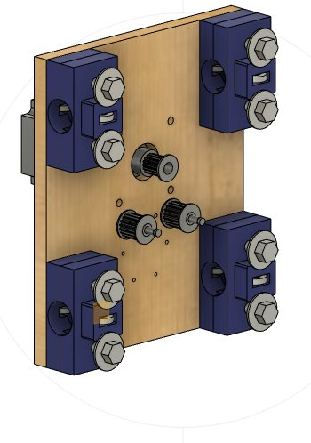
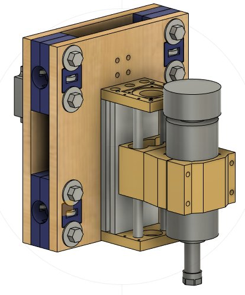
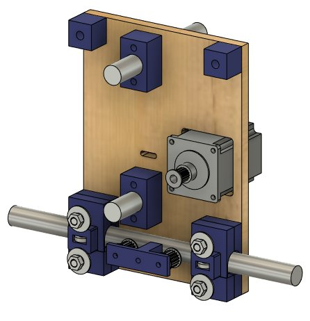
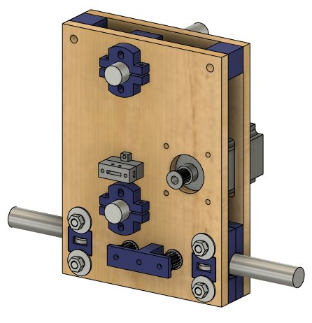

# esp32_cnc20mm - Initial Y Axis

**[Home](readme.md)** --
**[Design](design.md)** --
**[Details](details.md)** --
**[Electronics](electronics.md)** --
**[Box](box.md)** --
**[Spindle](spindle.md)** --
**Y-Axis** --
**[Table](table.md)** --
**[Build](build.md)** --
**[Laser](laser.md)** --
**[Accessories](accessories.md)** --
**[Software](software.md)** --
**[Notes](notes.md)** --
**[Projects](projects.md)**

Before settling on the current design, after constructing the
[controller box](box.md), I built an earlier version
of the *X-Sled* and *Y-Sled*.  I *cut some tubes* and constructed
it and tested it, and even made a YouTube video of it:

The **initial Y Sled** was wider than the current one.
After I constructed and tested it, I realized that I needed
to make it *narrower* to allow for more **Y travel** for
a given *tube length*.

Likewise, after this initial implementation, I realized that
I needed to make some changes to the **initial X Sled** design
as well.  In this design the *stepper motor* extended out of the
side of the wood and the **idler bearings** were housed *outside*
of the plywood assembly:

As with the initial Y Sled, I needed to squeeze as much **travel**
out of the X axis for a given set of tubes.  I also needed some way
to support the **Y Drag Chain**.  And I needed to simplify the outside
of the X-Sled so that it would not get in the way of the **Y Drag Chain**.
After thinking things through, I made, among others, the following design changes
to the X Sled;

- I came up with the odd shape that provides a support for the **Y Drag Chain**
- The **Idler bearings** are now *internal* to the plywood assembly to save space and not impede the *X Drag Chain*
- The **Y Tube Supports** are also now *internal* to the plywood assembly to save space and not impede the *X Drag Chain*
- The **Y-Tubes** are now farther apart to provide a greater resistance to their *twisting moment*

Both axes were completely redesigned to maximize the amount of travel for a given
set of tubes, removing about 2" from the overall needed table dimensions for a given
desired working area.  The current design is refected on the [Design](design.md) page
of this documentation, but I wanted to show the old design for *posterities sake*.

**Next** - Building the [**Table**](table.md) for the machine ...